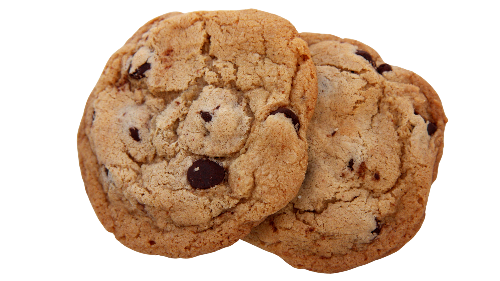

    <h3> Cookie Clicker </h3>
    
 Click the cookie as many times as possible, you can see your score on the left of the cookie. Have fun. 

    
 Keep in mind that the cookie counter resets once you leave or reload the page

<!--<button class="cookiepicture" type="submit">-->

<!--</button>-->

    Cookie Clicked 0 Times

<!---->

